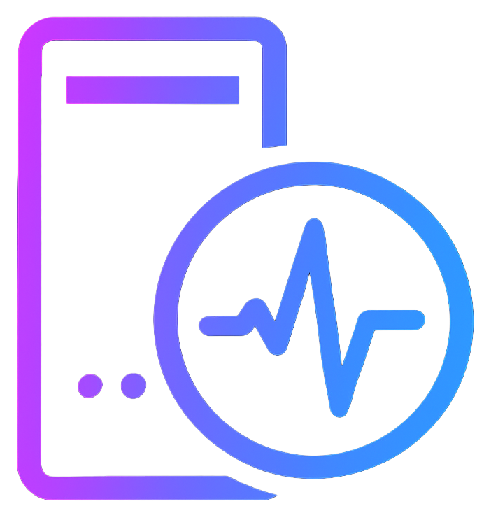
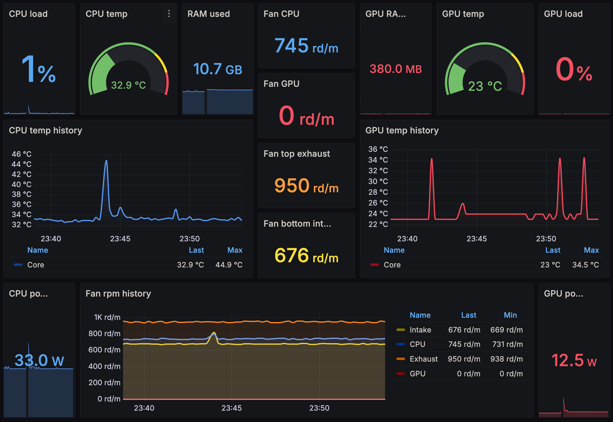

# 🖥️ Rigbeat

[](https://opensource.org/licenses/MIT)
[](https://www.python.org/downloads/)
[](https://prometheus.io/)
[](https://vegardhw.github.io/rigbeat/)

<div align="center">
    
</div>

**Prometheus exporter for Windows hardware monitoring** - Track your gaming PC's temperatures, fan speeds, and performance with beautiful Grafana dashboards.
> 🎯 **Perfect for gaming PCs, workstations, and home labs — especially easy if you already have Prometheus and Grafana running. Docker deployment also available.**

<!-- DASHBOARD SCREENSHOT -->

*📱 Mobile-optimized dashboard showing CPU/GPU temps, fan speeds, and system performance*

## ✨ Key Features

- 🌡️ **Real-time Temperature Monitoring** - CPU/GPU temperatures per core and sensor
- 💨 **Smart Fan Detection** - Auto-categorizes GPU, CPU, chassis, and other fans
- ⚡ **Power Consumption Tracking** - CPU/GPU power draw monitoring for efficiency analysis
- 🚀 **High Performance** - HTTP API integration with ~90% less CPU overhead than WMI
- 📊 **Performance Metrics** - CPU/GPU load, clock speeds, memory usage
- 📱 **Mobile-Optimized Dashboard** - Perfect for tablets and phones
- 🛡️ **Robust Windows Service** - Graceful handling with demo mode support
- 🔧 **Low Overhead** - Under 50MB RAM, minimal performance impact

## 🚀 Quick Start

### 1. **Download & Install**
```bash
# Download latest release from GitHub
# https://github.com/vegardhw/rigbeat/releases

# Install LibreHardwareMonitor (required)
# https://github.com/LibreHardwareMonitor/LibreHardwareMonitor/releases

# Run install script as Administrator
# Right-click Install-Rigbeat.bat → "Run as Administrator"
```

### 2. **Verify Installation**
Visit **http://localhost:9182/metrics** to see your hardware metrics:
```prometheus
rigbeat_cpu_temperature_celsius{sensor="CPU Package"} 45.0
rigbeat_cpu_power_watts{sensor="CPU Package"} 65.2
rigbeat_gpu_temperature_celsius{gpu="nvidia_geforce_rtx_4080"} 52.0
rigbeat_gpu_power_watts{gpu="nvidia_geforce_rtx_4080"} 185.5
rigbeat_fan_speed_rpm{fan="gpu_fan_1",type="gpu"} 1850.0
```

**Performance Check:** Run with debug to verify HTTP API usage:
```bash
python hardware_exporter.py --debug
# Look for: 🚀 Connected to LibreHardwareMonitor HTTP API (optimized performance)
```

**Sensor Modes:** Choose monitoring level based on your needs:
```bash
# Essential mode (default) - core gaming metrics (~20 sensors)
python hardware_exporter.py --sensor-mode essential

# Extended mode - detailed monitoring (~60 sensors)
python hardware_exporter.py --sensor-mode extended

# Diagnostic mode - all sensors (~160 sensors)
python hardware_exporter.py --sensor-mode diagnostic
```

### 3. **Set Up Dashboard**
Import the included Grafana dashboard for beautiful visualizations:

<!-- GRAFANA DASHBOARD INSTRUCTIONS PLACEHOLDER -->
*📊 Complete Grafana setup instructions and dashboard gallery in the documentation*

## 📖 Docs

**[📚 Read the docs →](https://vegardhw.github.io/rigbeat/)**

## 🔍 Troubleshooting & Tools

### Sensor Discovery Tool
**Not sure what sensors are available?** Use the sensor discovery tool to see everything:
```bash
python sensor_discovery.py
# or for remote systems:
python sensor_discovery.py 192.168.1.100 8085
```

This tool shows:
- 🔍 All available hardware components (CPU, GPU, motherboard, storage)
- 🌡️ Complete sensor breakdown by type (temperature, load, fan, power, etc.)
- 🌬️ Fan analysis with RPM status monitoring
- 📊 Sensor count statistics
- 🎯 Preview of standardized Prometheus metric names

### Common Issues
- **No metrics showing?** Ensure LibreHardwareMonitor HTTP server is enabled
- **Missing sensors?** Run sensor discovery tool to verify what's available
- **High CPU usage?** Check that HTTP API is being used (not WMI fallback)

### 🤖 Built with AI Assistance

This project was created through AI-assisted development. Every component - from Windows service architecture to mobile-optimized dashboards - was designed and implemented collaboratively with Claude AI.

## 📜 License & Support

- **License**: MIT - see [LICENSE](LICENSE) file
- **Issues**: [Report bugs or request features](https://github.com/vegardhw/rigbeat/issues)
- **Discussions**: [Community chat and questions](https://github.com/vegardhw/rigbeat/discussions)

## 🙏 Acknowledgments

- **[LibreHardwareMonitor](https://github.com/LibreHardwareMonitor/LibreHardwareMonitor)** - Hardware sensor access
- **[Prometheus](https://prometheus.io/)** - Metrics collection and alerting
- **[Grafana](https://grafana.com/)** - Beautiful dashboard visualization

---

**⭐ Star this project if you find it useful!**

Made with ❤️ for the PC gaming and monitoring community