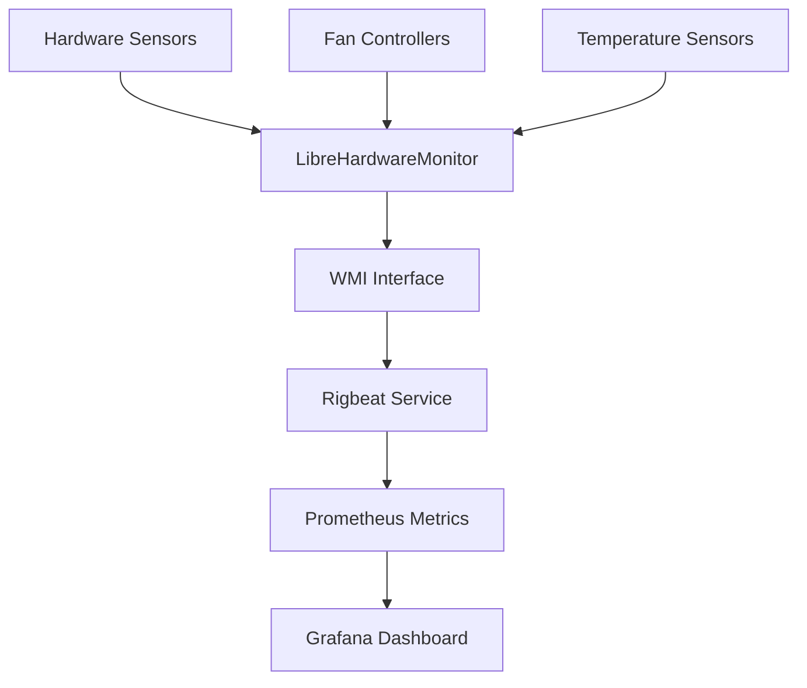

# Overview

Rigbeat provides comprehensive hardware monitoring for Windows systems through a simple yet powerful architecture.

## How It Works



## Architecture

### Data Flow
1. **Hardware Sensors** → LibreHardwareMonitor reads CPU/GPU temps, fan speeds
2. **WMI Interface** → Exposes sensor data via Windows Management Instrumentation  
3. **Rigbeat Service** → Collects and processes sensor data every 2 seconds
4. **Prometheus Metrics** → Exports standardized metrics on port 9182
5. **Grafana Dashboard** → Visualizes metrics with beautiful graphs and alerts

### Components

#### LibreHardwareMonitor
- **Purpose**: Hardware sensor access
- **Role**: Provides WMI interface to hardware sensors
- **Requirements**: Administrator privileges, WMI enabled

#### Rigbeat Service
- **Purpose**: Metrics collection and export
- **Features**: Windows service, demo mode, robust error handling
- **Output**: Prometheus-compatible metrics

#### Prometheus (Optional)
- **Purpose**: Metrics storage and querying
- **Benefits**: Historical data, alerting, advanced queries
- **Alternative**: Direct Grafana connection possible

#### Grafana Dashboard
- **Purpose**: Visualization and monitoring
- **Features**: Mobile-optimized, smart fan grouping, temperature alerts
- **Customizable**: Modify panels, thresholds, and layouts

## Metrics Categories

### 🌡️ Temperature Monitoring
- **CPU temperatures** per core/sensor
- **GPU temperatures** with device identification  
- **Intelligent labeling** (Core Complex, CPU Package, etc.)

### 💨 Fan Management  
- **Smart categorization**: GPU, CPU, Chassis, Other
- **Automatic numbering** from sensor names
- **RPM monitoring** with type-based grouping

### 📊 Performance Metrics
- **CPU/GPU load** percentages per core
- **Clock speeds** for CPU and GPU  
- **Memory usage** (system RAM and GPU memory)

### 🔧 System Information
- **Hardware detection**: CPU, GPU, motherboard identification
- **Service status**: Demo mode vs hardware monitoring mode
- **Connectivity**: LibreHardwareMonitor connection status

## Deployment Modes

### Production Mode
- **LibreHardwareMonitor running** with WMI enabled
- **Full hardware monitoring** with real sensor data
- **Complete metrics collection** for all supported hardware
- **Service logs**: "Hardware monitoring active"

### Demo Mode  
- **LibreHardwareMonitor unavailable** or WMI disabled
- **Service remains functional** for deployment testing
- **Basic system information** with demo values
- **Perfect for**: CI/CD testing, VM deployment validation

## Smart Features

### Intelligent Fan Detection
```python
# Examples of automatic fan categorization:
"GPU Fan #1"     → gpu_fan_1    (type: gpu)
"CPU Fan"        → cpu_fan      (type: cpu)  
"Chassis Fan 2"  → chassis_fan_2 (type: chassis)
"AIO Pump"       → aio_pump     (type: other)
```

### Robust Service Management
- **Graceful startup**: Works with or without hardware monitoring
- **Error recovery**: Handles LibreHardwareMonitor restarts
- **COM initialization**: Proper Windows service WMI access
- **Status reporting**: Clear logging of operational mode

### Mobile-First Dashboard
- **Responsive design**: Perfect on tablets and phones
- **Touch-friendly**: Optimized for mobile interaction
- **Efficient layout**: Information density optimized for small screens
- **Dark/light themes**: Automatic based on system preference

## Use Cases

### 🎮 Gaming PCs
- **Monitor thermals** during intensive gaming sessions
- **Fan curve optimization** based on real temperature data
- **Performance tracking** to identify thermal throttling

### 💼 Workstations  
- **Render farm monitoring** during heavy 3D/video work
- **CPU/GPU utilization** tracking for workload optimization
- **Preventive maintenance** through thermal trend analysis

### 🏠 Home Labs
- **24/7 monitoring** of always-on systems
- **Remote visibility** into hardware health
- **Historical analysis** for upgrade planning

### 🔧 System Building
- **Cooling validation** for new builds
- **Fan curve testing** and optimization
- **Thermal performance** verification under load

## Getting Started

Ready to start monitoring? Follow our step-by-step guides:

1. **[Installation →](/getting-started/installation)** - Get Rigbeat installed
2. **[Hardware Setup →](/guide/hardware-setup)** - Configure LibreHardwareMonitor  
3. **[Grafana Dashboard →](/guide/grafana)** - Set up beautiful visualizations
4. **[Best Practices →](/guide/best-practices)** - Optimize your monitoring setup